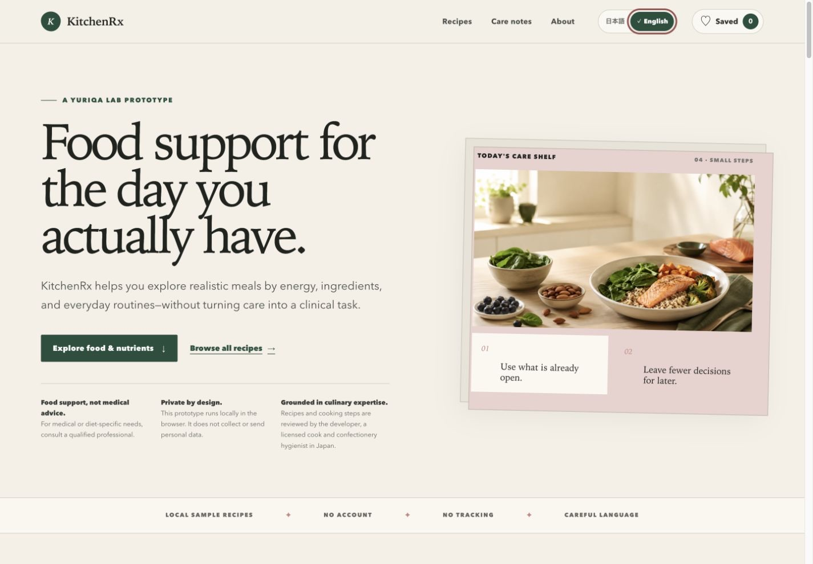
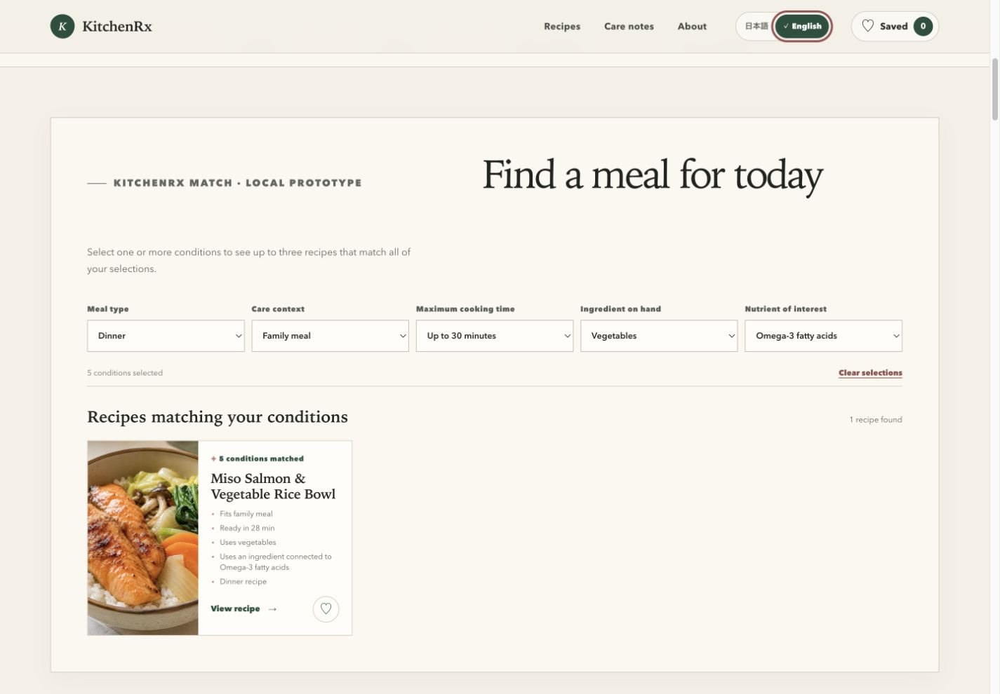
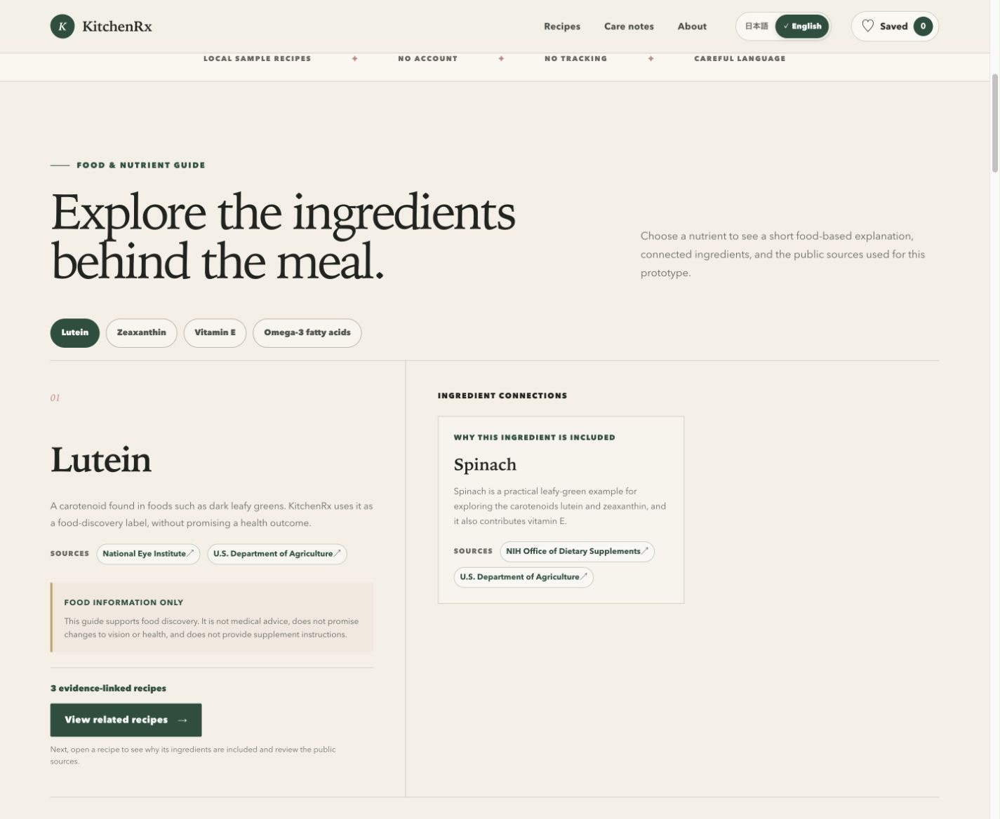
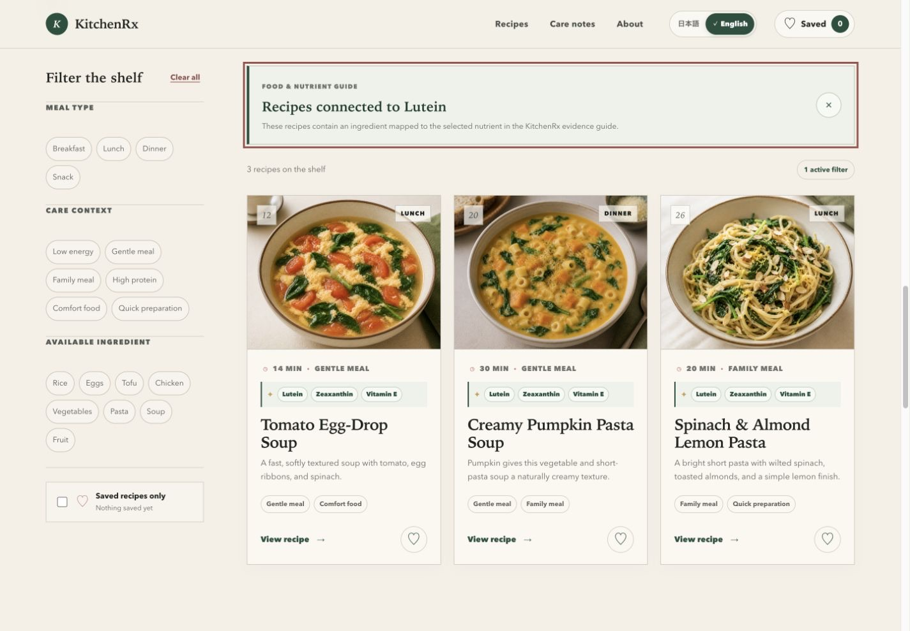
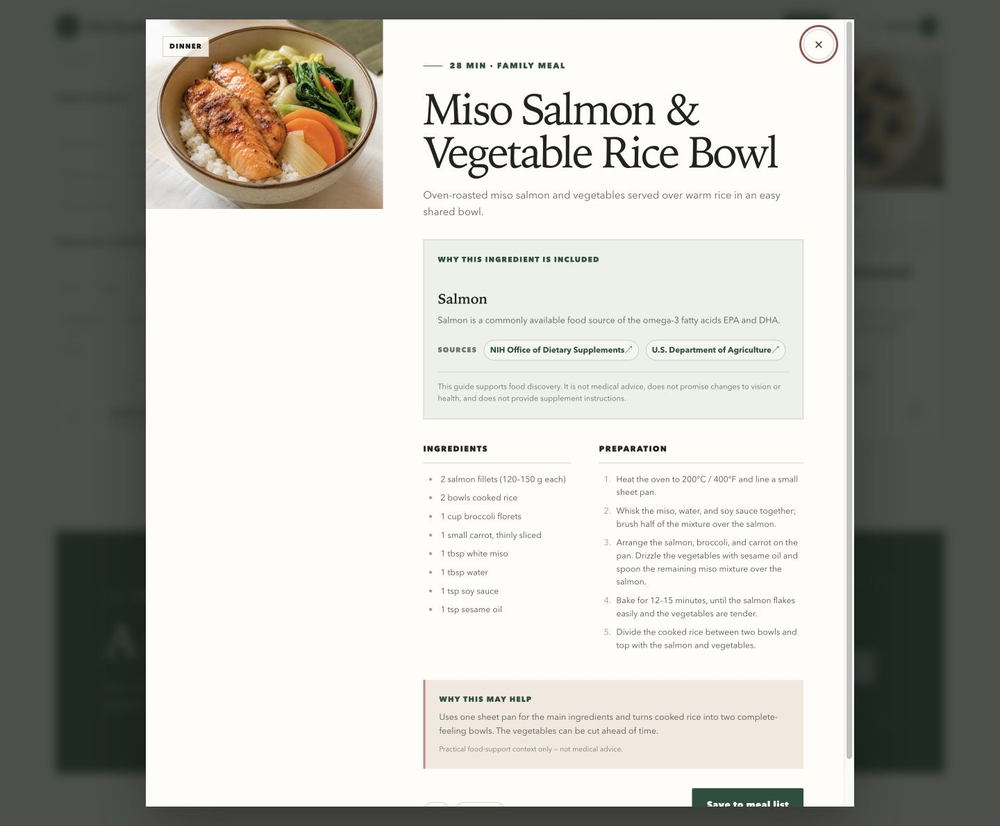
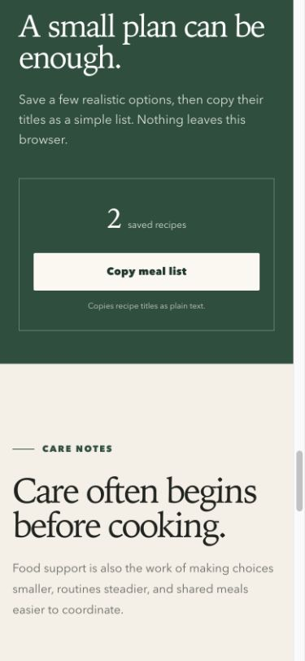

# KitchenRx

KitchenRx is a bilingual, care-oriented web application prototype by Yuriqa Lab. It helps people explore realistic meal ideas using practical contexts such as available energy, meal type, preparation time, ingredients already on hand, and food-based nutrient context.

**Live demo:** [Open KitchenRx](https://kitchenrx.yuriqa-lab.workers.dev)

The application is browser-focused and has no application data backend. It provides food and meal-planning information, not medical guidance.

## Why it exists

Food preparation is more than a recipe. It also includes deciding what feels possible, coordinating a shared meal, planning for cleanup, and protecting familiar routines. KitchenRx explores how hospitality knowledge and human-centered interface design can make those everyday decisions calmer and more manageable.

## Features

- **KitchenRx Match:** a transparent, explainable recipe matcher that applies every selected condition as a required filter
- Up to three exact Match results in stable recipe order, with only the reasons that actually matched and no unrelated fallback recipes
- Complete Japanese and English interface and recipe switching without a page reload
- 27 locally stored recipes written for this prototype, with bilingual titles, descriptions, ingredients, steps, and practical notes
- Meal type, care context, ingredient, and saved-recipe filters
- Four food-context nutrient filters: lutein, zeaxanthin, vitamin E, and omega-3 fatty acids
- Typed links between highlighted ingredients, related nutrients, recipes, and named public sources
- Evidence strips on relevant recipe cards and an in-context route from each nutrient to matching recipes
- Accessible recipe details with ingredient rationale, public-source links, a food-information disclaimer, ingredients, preparation steps, and careful practical notes
- Save-for-later support stored only in the browser with safe malformed-data handling
- Language changes preserve active filters, saved recipes, and the open recipe
- A separately stored language preference, browser-language detection on first visit, and English fallback
- A saved-only recipe view
- Localized plain-text meal-list copying with success and error feedback
- Responsive layouts, visible focus states, reduced-motion support, and keyboard-friendly controls
- Visible privacy and non-medical disclaimers

## KitchenRx Match

KitchenRx Match is a transparent, explainable matching tool over the existing 27-recipe collection. A person can choose any combination of:

- Meal type
- Care context
- Maximum cooking time
- Ingredient on hand
- Nutrient of interest

Every selected condition is required, and multiple selections are combined with **AND** logic. Match returns up to three existing recipes that satisfy all selections. It does not fill empty result slots with recipes that miss a condition, and each result shows only factual reasons derived from the selected conditions and recipe data.

The matching is fully deterministic: the same conditions return the same recipes in the same order. It uses no API, generative AI model, or backend.

## 90-second demo path

1. Choose one or more conditions in **KitchenRx Match**.
2. Review up to three exact matches and the factual reason shown for each selected condition.
3. Open a matched recipe to review its ingredients, steps, and food context, then save it to the meal list.
4. Select one of the four nutrient chips in the food and nutrient guide.
5. Review the related ingredient, named public sources, and matching recipes.

## Evidence and culinary review

KitchenRx keeps two trust signals separate:

- **Nutrition context:** named public sources support the displayed food-and-nutrient relationships. Source names and links are stored alongside the relevant bilingual content.
- **Culinary review:** recipe design and cooking steps are reviewed by the developer, a licensed cook and confectionery hygienist in Japan.

The culinary credentials are not presented as medical, dietetic, or nutrition-science credentials and are not used as evidence for health outcomes. KitchenRx provides food and meal-planning information only and does not give supplement instructions.

## Tech stack

- React 19
- TypeScript
- Next-compatible App Router rendered through the lightweight Vinext and Vite runtime
- Cloudflare Workers deployment
- Plain CSS
- Node.js built-in test runner
- `localStorage` for device-local saved recipe IDs and the independent language preference

No backend, authentication, database, external recipe API, analytics, tracking, or personal-data collection is used.

## Local development

Node.js 22.13 or newer is recommended.

```bash
npm install
npm run dev
```

Open the local address shown in the terminal.

## Included application data

All data required to run the prototype is included in this repository; no separate sample-data download or seed step is required. The 27 bilingual recipes are stored in [`app/data/recipes.ts`](app/data/recipes.ts), while the ingredient, nutrient, and public-source relationships are stored in [`app/data/nutrition.ts`](app/data/nutrition.ts). KitchenRx Match reads only this repository data and runs its matching logic locally in the browser.

## Production build

```bash
npm run build
```

Additional checks:

```bash
npm run typecheck
npm run lint
npm run test:logic
npm test
```

Current `build-week-amd` verification:

- `npm test` — 41/41 passing
- `npm run test:logic` — 39/39 passing
- `npm run build` — successful
- `npm run typecheck` — successful
- `npm run lint` — successful
- `git diff --check` — successful

## Project structure

```text
app/
  components/       Interactive application and recipe detail UI
  data/             Stable recipe data with localized content
  i18n/             Japanese and English interface translations
  lib/              Deterministic matching, filtering, localization, persistence, and list formatting logic
  types/            Shared recipe and filter types
  globals.css       Complete visual system and responsive styles
  layout.tsx        Metadata and document shell
  page.tsx          Application entry point
public/              Optimized hero, recipe, and social preview assets
docs/screenshots/    Current README screenshots
tests/               Logic and rendered-output checks
worker/              Static application runtime entry
```

## Privacy

KitchenRx runs in the browser. It does not collect or send personal data, health data, or browsing behavior. Saved recipe IDs remain in the current browser under `kitchenrx:saved-recipes:v1`. The independent language preference is stored under `kitchenrx:language:v1`. Both can be removed by clearing site storage.

## Non-medical disclaimer

**KitchenRx is a food-support prototype, not medical advice. For medical or diet-specific needs, consult a qualified professional.**

Recipe contexts such as “gentle meal,” “high protein,” and “low energy” describe practical meal-planning situations only. They are not health-outcome claims.

## Yuriqa Lab connection

Yuriqa Lab explores practical intersections between AI, care systems, hospitality, food systems, and human-centered interfaces. KitchenRx is an experiment in translating those themes into a quiet, useful decision-support interface.

## OpenAI Build Week development

The recoverable pre-Build Week release is preserved at tag `build-week-baseline-v1.1`, commit `f7cca4a436b20b05a8e045335f524309ffca5589`. Build Week work continues on `build-week-amd`; it is not merged into `main` in this phase.

KitchenRx was built through iterative collaboration between Yuriqa and Codex:

- **Yuriqa led the product decisions.** She defined the care-oriented scope and evidence boundaries, reviewed the Japanese and English experience on real desktop and mobile screens, and approved each controlled iteration. For KitchenRx Match, she decided that every selected meal, care-context, time, ingredient, and nutrient condition must be combined with **AND** logic. She also decided that a zero-match result must remain honest rather than being padded with recipes that miss a condition.
- **Codex accelerated implementation and verification.** It helped turn Yuriqa's decisions into the typed bilingual data model, deterministic Match logic, interface changes, automated tests, accessibility and responsive-layout checks, privacy review, screenshot and release documentation, and deployment preparation and verification.
- **GPT-5.6 supported the reasoning and review work through Codex.** It contributed to product and data-model design, deterministic matching review, food-information claim safety, Japanese and English copy review, interface critique, test planning, and final diff review.

GPT-5.6 and Codex were development tools, not runtime features. The published KitchenRx application does not call a generative AI API: KitchenRx Match uses deterministic local logic over the repository's existing recipe data. See [BUILD_WEEK.md](BUILD_WEEK.md) for the public development record and source list.

## Project status

KitchenRx is a scoped bilingual web application prototype with 27 recipes written for this project. The current Build Week version, including KitchenRx Match, is deployed on Cloudflare Workers. Its recipe collection remains local and illustrative, and the application is not intended for medical use.

## Future improvements

- Broader recipe collections
- More flexible ingredient matching
- Improved meal-plan organization and printable lists
- Additional languages beyond Japanese and English
- Formal accessibility and usability testing
- Optional offline-first support

## Screenshots

### English overview and trust information



### Transparent and explainable KitchenRx Match



### Nutrient discovery and matching recipes

<p align="center">
  
  
</p>

### Evidence-aware recipe detail



### Mobile saved recipes and meal list

<p align="center">
  
</p>

## License

Released under the MIT License. See [LICENSE](LICENSE).
