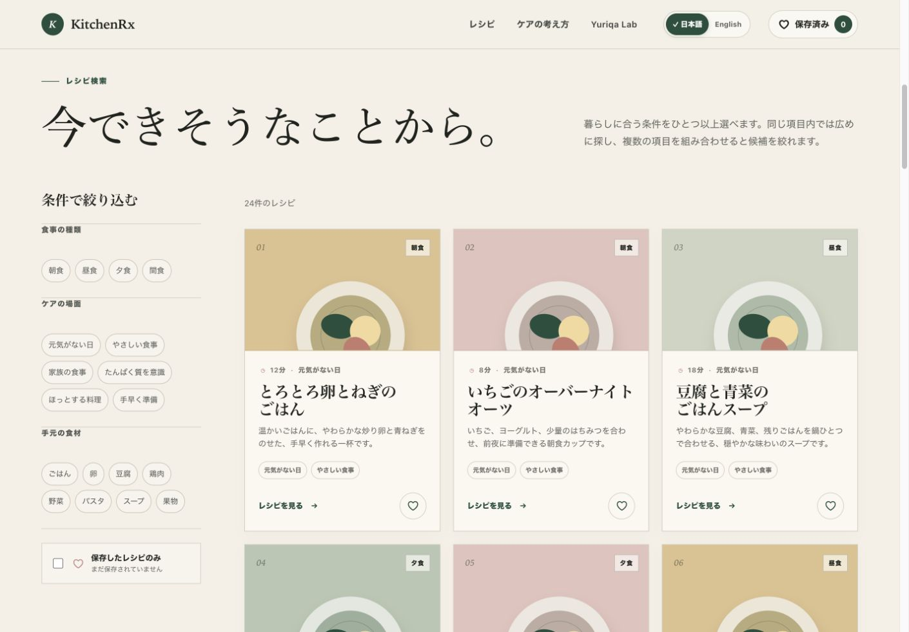
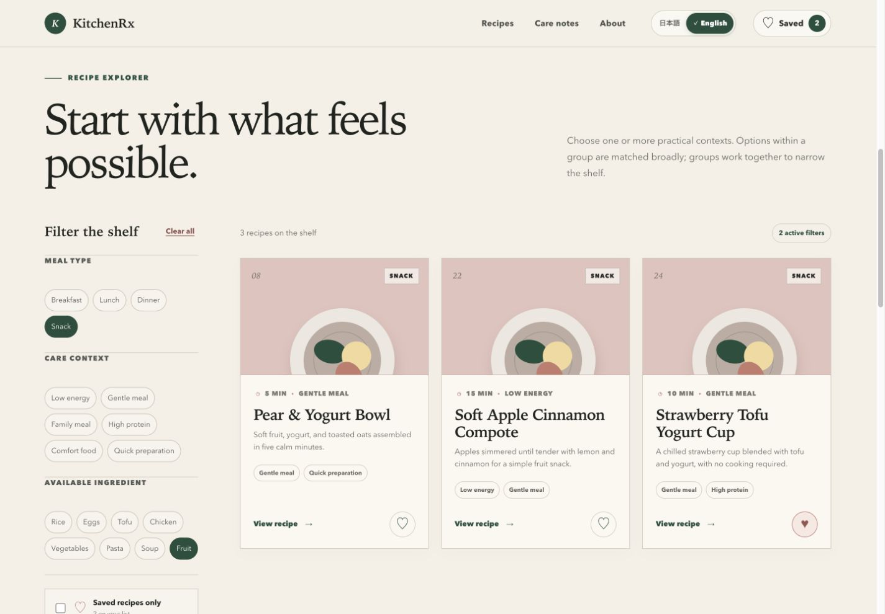
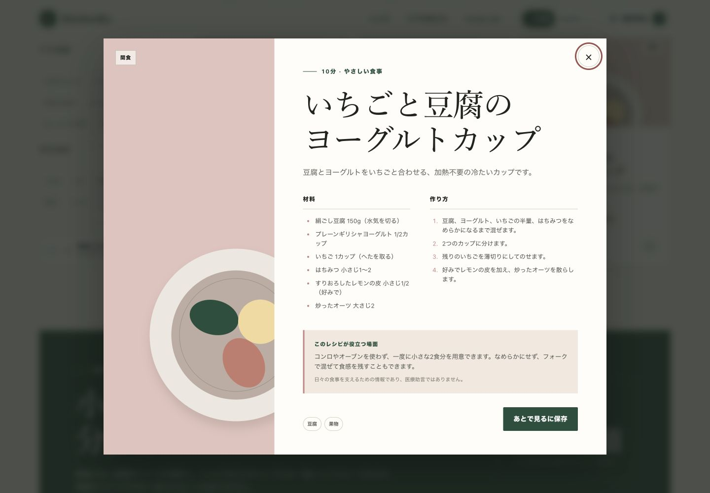
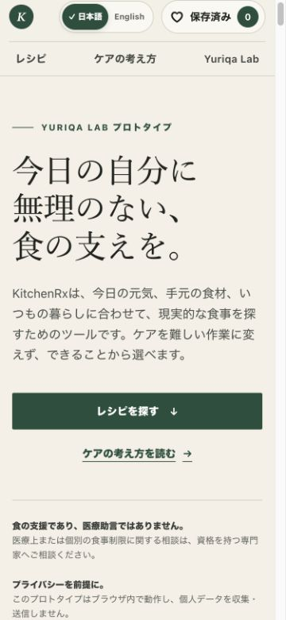

# KitchenRx

KitchenRx is a care-oriented recipe and meal-support prototype by Yuriqa Lab. It helps people explore realistic meal ideas using practical contexts such as available energy, meal type, preparation effort, and ingredients already on hand.

This is a browser-focused portfolio prototype with no application data backend, not a production medical service.

## Why it exists

Food preparation is more than a recipe. It also includes deciding what feels possible, coordinating a shared meal, planning for cleanup, and protecting familiar routines. KitchenRx explores how hospitality knowledge and human-centered interface design can make those everyday decisions calmer and more manageable.

## Features

- Complete Japanese and English interface switching without a page reload
- 24 locally stored recipes written for this prototype, with bilingual titles, descriptions, ingredients, steps, and practical notes
- Meal type, care context, and ingredient filters
- Combined filters, result counts, clear-all controls, and an empty state
- Accessible recipe details with ingredients, preparation steps, and careful practical notes
- Save-for-later support stored only in the browser with safe malformed-data handling
- Language changes preserve active filters, saved recipes, and the open recipe
- A separately stored language preference, browser-language detection on first visit, and English fallback
- A saved-only recipe view
- Localized plain-text meal-list copying with success and error feedback
- Responsive layouts, visible focus states, reduced-motion support, and keyboard-friendly controls
- Visible privacy and non-medical disclaimers

## Tech stack

- React 19
- TypeScript
- Vite through the lightweight Vinext application runtime
- Next.js App Router components, built through the lightweight Vinext runtime
- Plain CSS
- Node.js built-in test runner
- `localStorage` for device-local saved recipe IDs and the independent language preference

No backend, authentication, database, external recipe API, analytics, tracking, or personal-data collection is used.

## Local development

Node.js 22.13 or newer is recommended.

```bash
npm install
npm run dev
```

Open the local address shown in the terminal.

## Production build

```bash
npm run build
```

Additional checks:

```bash
npm run typecheck
npm run lint
npm run test:logic
npm test
```

## Project structure

```text
app/
  components/       Interactive application and recipe detail UI
  data/             Stable recipe data with localized content
  i18n/             Japanese and English interface translations
  lib/              Filtering, localization, persistence parsing, and list formatting logic
  types/            Shared recipe and filter types
  globals.css       Complete visual system and responsive styles
  layout.tsx        Metadata and document shell
  page.tsx          Application entry point
public/              Social preview asset
tests/               Logic and rendered-output checks
worker/              Static application runtime entry
```

## Privacy

KitchenRx runs locally in the browser. It does not collect or send personal data, health data, or browsing behavior. Saved recipe IDs remain in the current browser under `kitchenrx:saved-recipes:v1`. The independent language preference is stored under `kitchenrx:language:v1`. Both can be removed by clearing site storage.

## Non-medical disclaimer

**KitchenRx is a food-support prototype, not medical advice. For medical or diet-specific needs, consult a qualified professional.**

Recipe contexts such as “gentle meal,” “high protein,” and “low energy” describe practical meal-planning situations only. They are not diagnoses, treatments, or health-outcome claims.

## Yuriqa Lab connection

Yuriqa Lab explores practical intersections between AI, care systems, hospitality, food systems, and human-centered interfaces. KitchenRx is an experiment in translating those themes into a quiet, useful decision-support interface.

## Project status

KitchenRx is a scoped v1.1 bilingual portfolio prototype with 24 recipes written for this prototype. Its recipe collection remains local and illustrative. It has not undergone clinical validation and is not intended for medical use.

## Future improvements

- Richer original recipe collections
- More flexible ingredient matching
- Improved meal-plan organization and printable lists
- Additional languages beyond Japanese and English
- Formal accessibility and usability testing
- Optional offline-first support

## Screenshots

### Japanese recipe explorer



### Filtering and recipe details

<p align="center">
  
  
</p>

### Mobile layout

<p align="center">
  
</p>

## License

Released under the MIT License. See [LICENSE](LICENSE).
